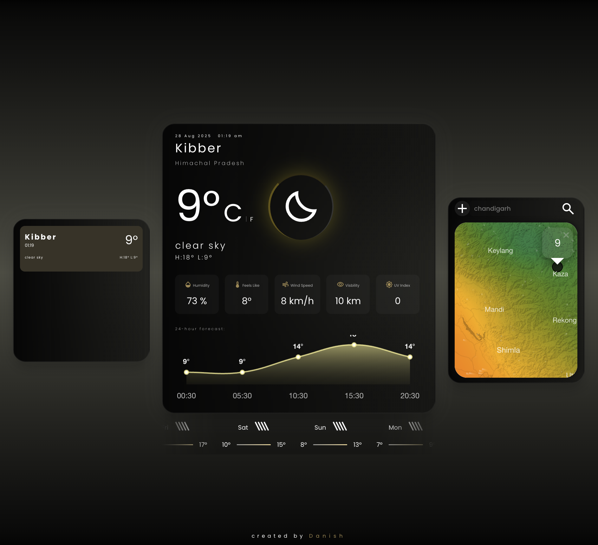
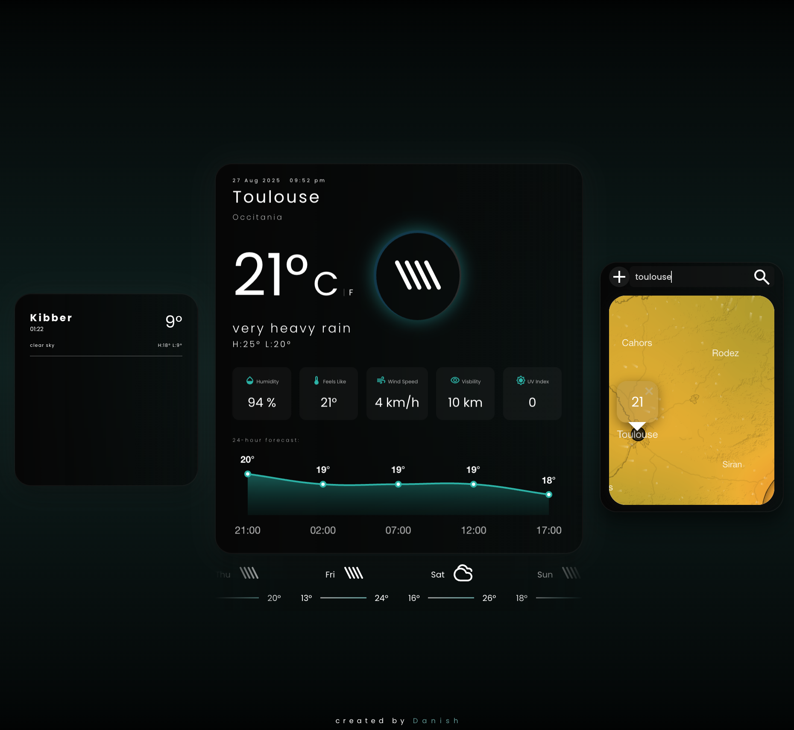

Hello-Weather 🌦️
Hello-Weather is a sleek, modern, and responsive weather application that provides real-time weather data for any location. Built with a focus on a clean user interface and dynamic data visualization, it goes beyond simple forecasts to include an interactive thermal map and a persistent list of your favorite locations.

✨ Features
Real-time Weather Data: Get the current temperature, conditions, humidity, wind speed, and visibility for any city.

Global Search: Find weather information for any location in the world.

❤️ Favorites List: Save your most-viewed locations for quick access. The list stays dynamically updated with the latest conditions as you interact with the app.

🗺️ Interactive Thermal Map: As a map and geography nerd, I had to include this! The app features an interactive thermal (temperature) map, powered by the Windy.com API, to visualize weather patterns.

📊 24-Hour Forecast Chart: A smooth, interactive line graph showing the hourly temperature forecast.

📅 7-Day Forecast: A clear view of the weather for the upcoming week.

📱 Fully Responsive Design: A beautiful and seamless experience on desktop, tablet, and mobile.

🚀 Live Demo
View the live project here!
https://dan0101git.github.io/Hello-Weather/

🛠️ Tech Stack
Frontend: HTML5, CSS3, JavaScript (ES6+)

APIs: OpenWeatherMap API, Windy.com API

Libraries: Chart.js for graphs, Leaflet.js for mapping

Build Tool: Webpack

Code Quality: ESLint

💻 Local Setup
To get a local copy up and running, follow these simple steps.

Prerequisites
Node.js and npm

Installation
Clone the repo

Bash

git clone https://github.com/Dan0101Git/Hello-Weather.git
Navigate to the project directory

Bash

cd Hello-Weather
Install NPM packages

Bash

npm install
Start the development server

Bash

npm start
🙏 Acknowledgments
This project was built as part of The Odin Project curriculum.

Weather data provided by OpenWeatherMap.

Map layers powered by Windy.com.
